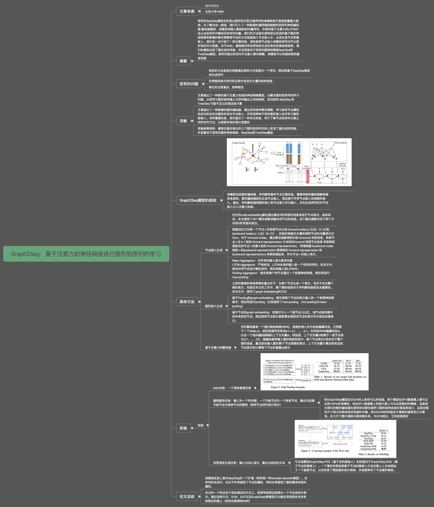
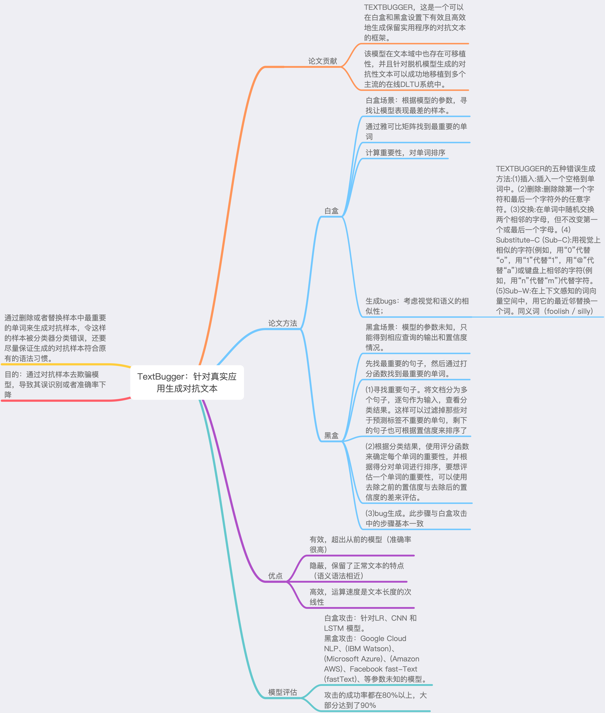
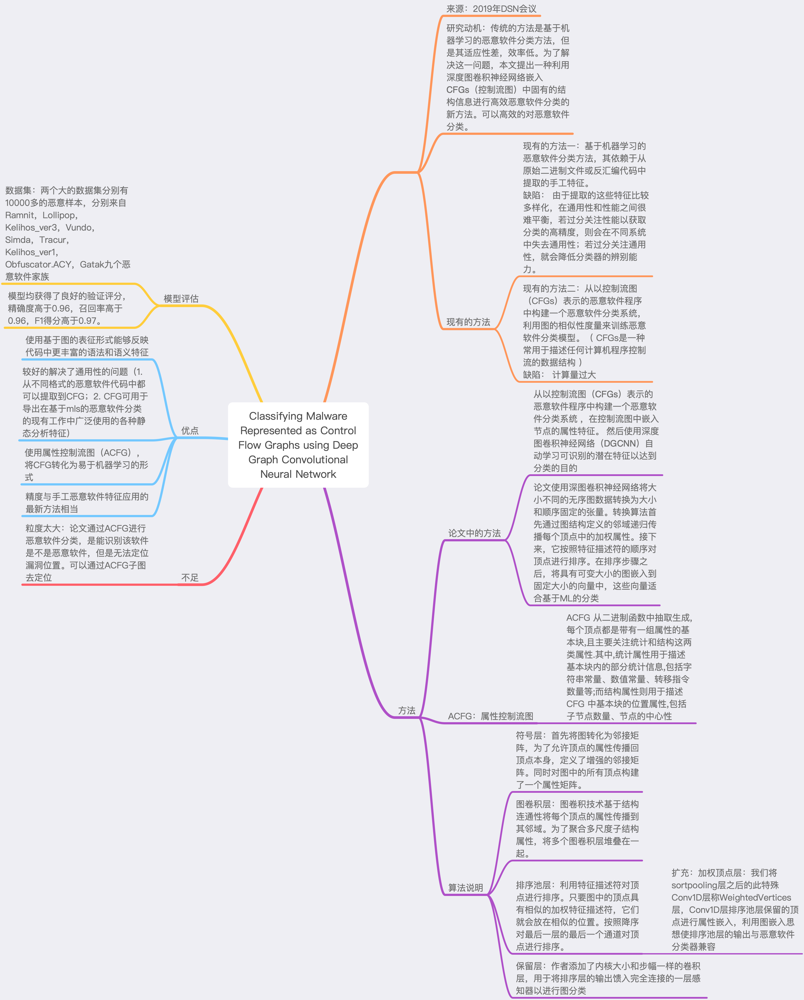

# Paper-Reading
主要是自己看过的一些论文，同时做了对应的思维导图，以供大家参考学习。

### 1.GRAPH2SEQ: GRAPH TO SEQUENCE LEARNING WITH ATTENTION-BASED NEURAL NETWORKS
ICLR2019-Graph2Seq：基于注意力的神经网络进行图形到序列的学习

### 2.TEXTBUGGER: Generating Adversarial Text Against Real-world Applications
TextBugger：针对真实应用生成对抗文本

### 3.Classifying Malware Represented as Control Flow Graphs using Deep Graph Convolutional Neural Network
使用深度图卷积神经网络对CFG表示的恶意软件进行识别

